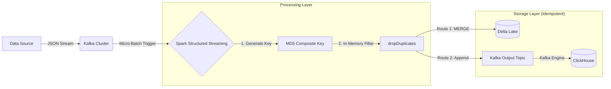

# Idempotent Real-Time Data Pipeline 

    

A fault-tolerant, high-throughput streaming pipeline designed to solve the **"Replay Problem"** in distributed systems. This project implements a **Lambda Architecture** using Spark Structured Streaming, ensuring 100% data integrity and idempotency across both transactional storage (Delta Lake) and analytical storage (ClickHouse).

-----

## 📖 Project Overview

In distributed systems, ensuring **"Exactly-Once"** processing is difficult. Network retries and system crashes often lead to data duplication ("At-Least-Once" semantics).

This pipeline solves this by implementing a **Deterministic Deduplication Strategy**. It fingerprints every event using a composite key and utilizes ACID transactions to reject duplicates at the storage level. Even if the same 1GB log file is ingested 10 times, the database state remains consistent.

### Key Features

  * **🛑 Defense-in-Depth Deduplication:**
    1.  **In-Memory:** Spark drops duplicates within the current micro-batch.
    2.  **Storage-Level:** Delta Lake performs `MERGE` (Upsert) operations to reject historical duplicates.
    3.  **Analytical:** ClickHouse uses `ReplacingMergeTree` for eventual consistency.
  * **🔑 Deterministic Identity:** Uses `MD5(User + Event + Timestamp)` to generate immutable event IDs.
  * **⚡ Handling Data Skew:** Engineered to handle massive throughput spikes (11k records/sec) followed by idle periods.
  * **🔄 Fault Tolerance:** Full state recovery via Checkpointing and Write-Ahead Logs (WAL).

-----

## 🏗️ Architecture



### Components

| Component | Role | Configuration |
| :--- | :--- | :--- |
| **Apache Kafka** | Ingestion Buffer | 2 Brokers, 4 Partitions, RF=2 |
| **Apache Spark** | Processing Engine | Structured Streaming (15s Trigger) |
| **Delta Lake** | Batch Layer | ACID Storage, `MERGE` Logic |
| **ClickHouse** | Speed Layer | `ReplacingMergeTree` Engine |

-----

## 🚀 Getting Started

### Prerequisites

  * Docker & Docker Compose
  * Python 3.9+ (For local data generation scripts)

### Installation

1.  **Clone the repository:**

    ```bash
    git clone https://github.com/yourusername/idempotent-pipeline.git
    cd idempotent-pipeline
    ```

2.  **Start the Infrastructure:**

    ```bash
    # This builds the custom Spark image and starts Zookeeper, Kafka, and ClickHouse
    docker-compose up -d --build
    ```

3.  **Wait for Initialization:**
    The `kafka-setup` and `clickhouse-setup` containers will automatically configure topics and database schemas. Run `docker ps` to ensure all services are healthy.

-----

## 🧪 Usage & Testing Scenarios

We have included scripts to verify the system's robustness against data duplication.

### 1\. The "Noise" Test (Data Generation)

Generate a mathematically verifiable dataset: **10,000 unique records** + **1,000 intentional duplicates**.

```bash
python generate_static_data.py
# Output: Created test_data_10k.json (11,000 records total)
```

### 2\. The "Backfill" Simulation (Ingestion)

Simulate a massive historical data load.

```bash
python bulk_import.py
```

  * **Observation:** Check Spark logs. It will process 11,000 records but only write \~10,000 unique records to storage.

### 3\. The "Replay Attack" (Proof of Idempotency)

Simulate a catastrophic upstream failure where data is re-sent. **Run the bulk import again:**

```bash
python bulk_import.py
```

  * **Result:** Despite receiving 11,000 "new" messages, the **Delta Lake row count remains unchanged**. This proves the Idempotency logic is working.

### 4\. Analysis

Generate a statistical report on batch performance and skewness.

```bash
# Capture logs
docker logs spark-job > spark_logs.txt
# Run analysis
python analyze_batch_performance.py
```

-----

## 🧠 Technical Deep Dive

### The Deduplication Logic (`spark_consumer.py`)

The core of this project is the `MERGE` operation. Instead of blindly appending data, we perform a Left Join between the **Incoming Batch (Source)** and **Historical Data (Target)**.

```python
# Actual Code Implementation
delta_table.alias("target").merge(
    delta_df.alias("source"),
    "target.dedup_key = source.dedup_key"  # The Anchor
)
.whenMatchedUpdateAll()    # If key exists -> Update (No-Op) -> 0 Duplicates
.whenNotMatchedInsertAll() # If key is new -> Insert -> New Data
.execute()
```

### Handling Data Skew

The pipeline is designed to handle "bursty" traffic.

  * **Idle:** 0 records/sec.
  * **Spike:** 11,000 records/sec.
  * **Mitigation:** In production, `maxOffsetsPerTrigger` can be enabled to smooth these spikes into consistent micro-batches.

-----

## 📂 Project Structure

```text
.
├── docker-compose.yml           # Infrastructure definition (Zookeeper, Kafka, ClickHouse, Spark)
├── Dockerfile                   # Custom Spark image with Python dependencies
├── requirements.txt             # Python libraries (kafka-python, delta-spark)
├── spark_consumer.py            # Main Spark Streaming Application (Dedup & Merge logic)
├── generate_static_data.py      # Data generator (Creates 10k unique + 1k duplicate records)
├── bulk_import.py               # High-throughput producer script (Simulates Backfill/Replay)
├── producer.py                  # Low-throughput "trickle" simulator (Simulates Live Traffic)
├── analyze_batch_performance.py # Log analysis tool (Calculates Skewness & Throughput)
└── README.md                    # Project documentation
```

-----
## 👥 Contributors

This project is a collaborative effort by a dedicated team of 5
- [**Nishtha**](https://github.com/novnishtha)
- [**Riya**](https://github.com/Riyag012)
- [**Pulkit**](https://github.com/pulkitjn3010)
- [**Shivansh**](https://github.com/sh1vanshgaur)
- [**Anuj**](https://github.com/animus08)
